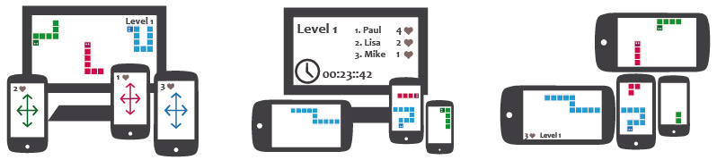

## Multi ##

Multi is a framework for [web based multi-screen games](http://christine-coenen.de/blog/2013/11/14/web-based-multi-screen-games/) based on node.js and socket.io.
It allows to connect multiple devices to one game session, to sync player attributes across all clients and to combine the devices screens to one big playing field. Visit http://multi.christine-coenen.de/documentation/ for the full documentation and some [tutorials](http://multi.christine-coenen.de/documentation/tutorial-start.html).



### Examples ###
You can view some example apps at http://multi.christine-coenen.de/

For these examples to work properly you may need an up-to-date version of firefox, chrome, firefox mobile, chrome for android or safari mobile. The presenter examples (One player snake and Multi player snake) can only be started once on this server. This is intended behaviour as these games are designed to run on local installations (e.g. on fairs, exhibitions, etc.).

These games are examples to demonstrate the frameworks capabilities and not yet fully polished. If you find bugs - especially regarding player registration, syncing or crashes - please feel free to report them. 

### Requirements ###
- node.js (>= 0.8)
- NPM package manager (apt-get install npm)

### How to start ###
1. Clone this repository with `git clone git@github.com:cemrich/multi.git`

1. Before starting run `cd multi` and `npm install` in your terminal to install all dependencies.

1. To start the application run `node app` in your terminal and visit http://localhost. 

   The application tries to bind to port 80 - so this command may require root permission on unix systems. To bind multi to another port run `export PORT=<portnr>` before you start the app.

1. Before you check out the example games please make sure to adjust [public/js/SERVER.js](public/js/SERVER.js) to your needs. Replace localhost with your machines external ip address and the port you told multi to use. If you don't make this modifications you can still use the examples on your local machine, but you will not be able to pair any other device with the server.

1. It is recommended to build the documentation with `grunt jsdoc`. After that you can view it under [public/documentation/index.html](public/documentation) or [http://localhost/documentation](http://localhost/documentation) when the server is running.

### Development ###

For development run:

- `grunt jsdoc` to generate documentation
- `grunt build` to build the client side library
- `grunt test` to run jshit and unit tests
- `grunt watch` to jshint files on change and build client side library when required

### API ###

#### Server Side ####

If you don't intent to write any server side code (you don't have to!), simply use the running server also used by the other examples and skip this section. 

```javascript
  // load the server side multi lib
  var multiModule = require('./multi/server');

  // create a new server listening to port 8080
  // this will be used for socket connections
  // you could also use express to create the server
  var server = require('http').createServer().listen(8080);

  // get a Multi instance by passing your server
  var multi = multiModule.init(server);

  // log every newly created session
  multi.on('sessionCreated', function (event) {
    console.log('new session created!', event.session.token);
  });
```

#### Client Side ####

To use Multi in your javaScript file you have to use [require.js](http://www.requirejs.org/) at the moment:

```javascript
    // configure where multi can find your client side socket.io lib
    requirejs.config({
      paths: {
        'socket.io': 'http://mySocketioServer/socket.io/socket.io.js'
      }
    });
    
    // require the [client/multi] client side lib
    requirejs(['../lib/multi'], function (multiModule) {
      
      // say multi where to find the running socket server
      // via [client/multi~MultiOptions]
      var multiOptions = {
        server: 'http://mySocketioServer/'
      };
      
      // init multi with your options 
      // a [client/multi~Multi] instance will be returned
      var multi = multiModule.init(multiOptions);
      
      // create a new session with success and error callback
      // see: [client/multi~Multi#createSession]
      multi.createSession().then(onSession, onSessionFailed).done();
    };
```

For more examples of how to use the API visit the [quick start](http://multi.christine-coenen.de/documentation/tutorial-start.html) tutorial.

### Bundled libraries ###
Multi comes with bundled libraries on client and server side:

- [q promises library](https://github.com/kriskowal/q) - The MIT License ([MIT])
- [watchJS](https://github.com/melanke/Watch.JS) - The MIT License ([MIT])

[MIT]: http://opensource.org/licenses/MIT

### Security ###
Multi is a bachelor thesis project and has not been security tested in any way. It uses no encryption ore secure handshaking at all and may be vulnerable to all kind of attacks. If you use it in production do so at your own risk.

### Licence ###

The MIT License ([MIT])

Copyright (c) 2013 cemrich

Permission is hereby granted, free of charge, to any person obtaining a copy
of this software and associated documentation files (the "Software"), to deal
in the Software without restriction, including without limitation the rights
to use, copy, modify, merge, publish, distribute, sublicense, and/or sell
copies of the Software, and to permit persons to whom the Software is
furnished to do so, subject to the following conditions:

The above copyright notice and this permission notice shall be included in
all copies or substantial portions of the Software.

THE SOFTWARE IS PROVIDED "AS IS", WITHOUT WARRANTY OF ANY KIND, EXPRESS OR
IMPLIED, INCLUDING BUT NOT LIMITED TO THE WARRANTIES OF MERCHANTABILITY,
FITNESS FOR A PARTICULAR PURPOSE AND NONINFRINGEMENT. IN NO EVENT SHALL THE
AUTHORS OR COPYRIGHT HOLDERS BE LIABLE FOR ANY CLAIM, DAMAGES OR OTHER
LIABILITY, WHETHER IN AN ACTION OF CONTRACT, TORT OR OTHERWISE, ARISING FROM,
OUT OF OR IN CONNECTION WITH THE SOFTWARE OR THE USE OR OTHER DEALINGS IN
THE SOFTWARE.
